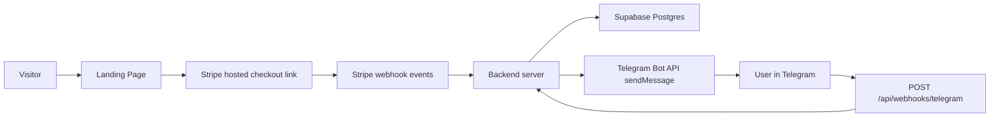
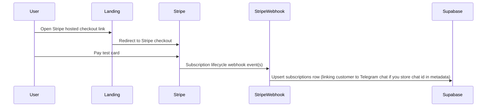
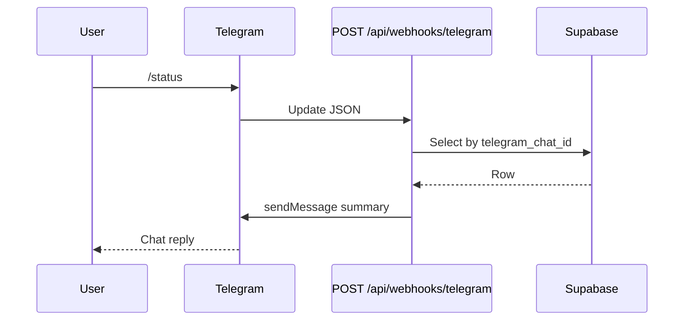

# Architecture — Messenger-Native SaaS

This document describes the **reference** flow implemented in this repository. Swap **Telegram** for another messenger API when needed; the billing and data layers stay the same.

## High-level diagram

## Components

| Layer | Role |
| ------- | ------ |
| **Landing (static HTML/CSS)** | Marketing + CTA; collects optional `telegram_chat_id` so Stripe metadata can link billing to chat. |
| **Stripe** | Checkout Session (subscription mode), webhooks for lifecycle events. |
| **Backend** | Hosts HTTP routes: checkout session creation (optional), Stripe webhook, Telegram webhook. |
| **Supabase** | Persists `subscriptions` (customer id, subscription id, status, `telegram_chat_id`). |
| **Telegram** | Primary UX: commands such as `/start` and `/status`, implemented via **getUpdates webhook** (not long polling in serverless). |

## Sequence — subscribe

## Sequence — bot command

## Environment boundaries

- **Public**: generally none for the webhook endpoints; if you add a frontend, you may use the Supabase anon key only for non-sensitive reads.
- **Secret**: Stripe keys + webhook secret, `SUPABASE_SERVICE_ROLE_KEY`, `TELEGRAM_BOT_TOKEN`, optional `TELEGRAM_WEBHOOK_SECRET` (used only in your backend).

Never expose the **service role** key to the browser.

## Extending the pattern

- **Richer bot UX**: inline keyboards, Mini Apps (Telegram), structured flows per feature flag.
- **Account linking**: magic links, email verification, or OAuth if you add a web account center.
- **Multi-tenant**: separate Stripe customers per workspace; map `telegram_chat_id` → `workspace_id` in Supabase.

See [docs/security-and-compliance.md](docs/security-and-compliance.md) before handling regulated or sensitive data.
