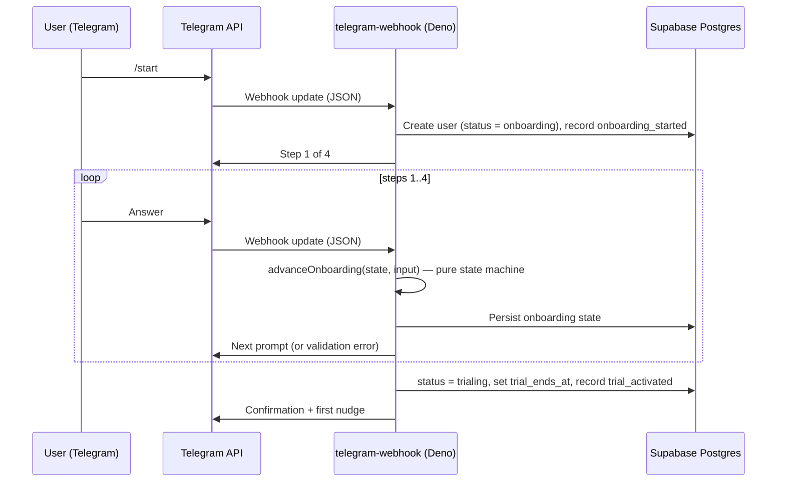

# Architecture — Messenger-Native SaaS

This document describes the **reference flow and Edge-first architecture** as implemented by the starter in this repository.

## Main system components (tech stack)

| Layer | Technology & role | In v1 |
| ----- | ---------------- | --- |
| **UX & interface** | **Telegram** — the only user interface. This is where the four-step onboarding-first flow runs. | ✅ core |
| **Data & state** | **Supabase (Postgres)** — users keyed by `telegram_id`, plus an append-only `events` funnel log. | ✅ core |
| **Logic (compute)** | **Supabase Edge Functions (Deno)** — `telegram-webhook` handles every update; a pure state machine drives onboarding. | ✅ core |
| **AI engine** | **Gemini API** — called to personalize the wording of messages, never the business logic. | optional adapter (stub fallback) |
| **Payments** | **Stripe** — checkout link + a lifecycle-webhook skeleton. | optional skeleton |
| **Observability** | **PostHog & Sentry** — funnel events and edge error tracking. | optional, no-op without env |

The core (Telegram + Postgres + the Deno function) runs on its own; every other layer is an optional adapter that degrades gracefully.

## Sequence — onboarding-first flow

The user never fills a signup form. Their record is created and the trial is activated entirely through the conversation.

## Why a pure state machine

`onboarding.ts` is a pure reducer — `advance(state, input) → { state, reply, activated }` — with no database, network, or clock inside it. The dispatcher persists the returned state and performs side effects. That separation is what makes the onboarding logic exhaustively unit-testable without any infrastructure, and is the discipline behind principle #6 (*deterministic core, AI at the edges*) in the [README](README.md).

---

*Docs version **2.0** — same `MAJOR.MINOR` rules as the footer in `README.md`.*
