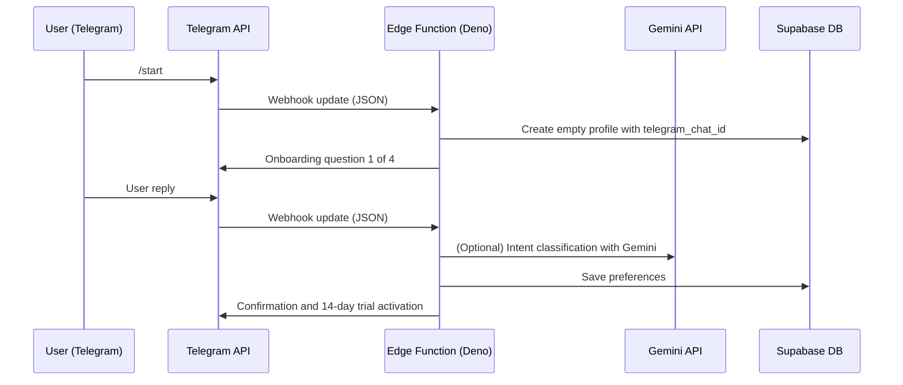

# Architecture — Messenger-Native SaaS

This technical document describes the **reference flow and Edge-first architecture**.

## Main system components (tech stack)

| Layer | Technology & role |
| ----- | ---------------- |
| **UX & interface** | **Telegram** — Primary user interface. This is where the four-step “Onboarding-First Flow” runs. |
| **Data & state** | **Supabase (PostgreSQL)** — Auth via `chat_id`, user profiles, and subscription assignment. |
| **Logic (compute)** | **Supabase Edge Functions (Deno)** — Fast, serverless handlers for Telegram traffic (webhooks) and cron jobs (dispatcher). |
| **AI engine** | **Gemini API** — Called from Edge Functions to compose personalized content and assist the user. |
| **Payments** | **Stripe** — Trial period (14 days) and recurring billing (Checkout + webhooks). |
| **Observability** | **PostHog & Sentry** — Event analytics (PostHog) for the bot funnel and error tracking (Sentry) for Deno. |

## Sequence — Onboarding-first flow

The user does not create an account in the traditional way. Authorization and record creation happen seamlessly during the conversation.

*Documentation **v1.4** — same MAJOR.MINOR rules as the footer in `README.md`.*
