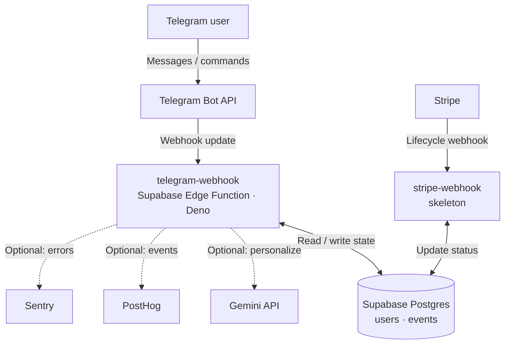

# Messenger-Native SaaS — starter kit

> **Messenger-Native SaaS** is a subscription product that lives entirely inside a chat app the user already has — nothing to install, the conversation *is* the UI, and the messenger's own notifications do the retention.

This repository is a **forkable, runnable starter**. Clone it, follow the Quick start, and you have a working Telegram bot — onboarding-first conversation, 14-day trial activation, Postgres persistence — running on the local stack in about ten minutes. The reference product built on this pattern is **[MoonQ](https://moonq.app)**.

The stack: **Telegram Bot API → Supabase Edge Functions (Deno/TypeScript) → Supabase Postgres**, with **Gemini** (AI), **Stripe** (billing), and **PostHog + Sentry** (observability) as clean, optional adapters that degrade gracefully when you haven't configured them yet.

<!-- TODO: add an onboarding demo GIF here (the /start → 4-step setup → trial activation flow). -->

---

## What's included

```
.
├── supabase/
│   ├── config.toml                         # local stack config (Postgres + Edge runtime)
│   ├── migrations/
│   │   └── 20260625000000_init.sql          # users + events tables, RLS, grants
│   └── functions/
│       ├── telegram-webhook/                # THE core function
│       │   ├── index.ts                     #   production entry (Deno.serve + real deps)
│       │   ├── app.ts                       #   createHandler(deps) — testable HTTP handler
│       │   ├── dispatcher.ts                #   command + conversation routing
│       │   ├── onboarding.ts                #   pure 4-step state machine
│       │   ├── telegram.ts                  #   typed Telegram client + update types
│       │   ├── onboarding.test.ts
│       │   └── dispatcher.test.ts
│       ├── stripe-webhook/index.ts          # billing webhook SKELETON (optional)
│       └── _shared/
│           ├── env.ts                       # required / optional env helpers
│           ├── security.ts                  # constant-time secret comparison
│           ├── repository.ts                # UserRepository interface + in-memory impl
│           ├── supabase-repository.ts       # Postgres-backed UserRepository
│           ├── ai.ts                        # Gemini adapter + deterministic stub
│           ├── billing.ts                   # Stripe adapter (skeleton)
│           ├── analytics.ts                 # PostHog + Sentry (optional, no-op without env)
│           └── graceful.test.ts             # proves optionals degrade without keys
├── scripts/
│   ├── smoke-test.ts                        # simulated /start → 200 + assert reply (no Docker)
│   └── set-webhook.sh                       # register the deployed webhook with Telegram
├── .github/workflows/ci.yml                 # deno fmt + lint + check + test + smoke
├── apps/landing/                            # optional static landing page
├── docs/                                    # case study, security, billing/AI TODOs
├── deno.json                                # tasks: check / lint / fmt / test / smoke / dev
└── .env.example                             # every variable the code reads
```

## Architecture



Solid arrows are the always-on core. Dotted arrows are optional integrations that no-op when their env vars are unset.

## The method, in named principles

1. **Zero install** — the client app is already on the user's phone; there is nothing to download.
2. **Conversation as UI** — onboarding, settings, and value delivery are all messages, not screens.
3. **Onboarding-first** — value (the trial) activates *inside the first conversation*, before any form or card.
4. **Notification-native retention** — re-engagement rides the messenger's own push channel (~80–90% open rates vs ~20% for email).
5. **Observability from message #1** — every step is an event, so you can see the funnel from the very first interaction.
6. **Deterministic core, AI at the edges** — business logic stays plain, testable code; the LLM only personalizes wording.

## Messenger-Native vs web SaaS vs native mobile app

| Dimension | Messenger-Native | Web SaaS | Native mobile app |
| --- | --- | --- | --- |
| Install / signup | None — open a chat | Account + password | Store download + account |
| Friction to first value | Seconds, in-chat | Form + email verify | Download, install, sign up |
| Notification open rate | ~80–90% | Email ~20% | Push often disabled |
| Retention surface | A chat they already check | Re-marketing emails | One icon among hundreds |
| Build cost | A single webhook | Frontend + backend + auth | Native app + store review |

## When to use / when NOT to use

**Use it when**

- Your value is a recurring message or quick interaction (a daily cue, an alert, a check-in, a focused Q&A).
- Your audience already lives in a messenger.
- You want the lowest possible signup friction and high notification reach.
- A short conversation can capture everything you need to onboard.

**Avoid it when**

- Your product needs rich UI — dashboards, tables, data viz, drag-and-drop.
- There's heavy data entry, file management, or long-form content editing.
- You need full control of the UI/brand surface, or compliance forbids storing data in a third-party chat context.

## Prerequisites

| Tool | Why | Required? |
| --- | --- | --- |
| [Deno](https://deno.com/) ≥ 2.x | runs and tests the functions | yes |
| [Docker](https://www.docker.com/) | runs the local Supabase stack | yes (for `supabase start`) |
| [Supabase CLI](https://supabase.com/docs/guides/cli) | local stack + deploy | yes |
| A Supabase account | hosts Postgres + the deployed function | to go live |
| A Telegram bot token from [@BotFather](https://t.me/BotFather) | the bot identity | to go live |
| A [Google Gemini](https://ai.google.dev/) API key | AI personalization | optional |
| A [Stripe](https://stripe.com/) account | billing | optional |

You can run the entire local Quick start and the smoke test **without any account or key** — the optional integrations fall back to stubs/no-ops.

## Quick start

### Run it locally and prove it works

```bash
# 1. Clone and enter
git clone https://github.com/heartmade-studio/messenger-native-saas.git
cd messenger-native-saas

# 2. Configure env (for a local-only run the placeholders are fine)
cp .env.example .env

# 3. Unit tests — onboarding state machine + dispatcher
deno task test

# 4. Smoke test — boots the real handler in memory, sends /start, asserts 200 + reply
#    (no Docker required)
deno task smoke

# 5. Start the local Supabase stack (Postgres + Edge runtime)
supabase start

# 6. Apply the migration (creates users + events)
supabase db reset

# 7. Serve the webhook function locally
supabase functions serve telegram-webhook --env-file .env
```

Then, in another terminal, send a simulated Telegram update (this is what Telegram itself POSTs):

```bash
source .env   # for TELEGRAM_WEBHOOK_SECRET
curl -X POST http://127.0.0.1:54321/functions/v1/telegram-webhook \
  -H "content-type: application/json" \
  -H "x-telegram-bot-api-secret-token: $TELEGRAM_WEBHOOK_SECRET" \
  -d '{"update_id":1,"message":{"message_id":1,"chat":{"id":42},"text":"/start"}}'
# => {"ok":true}  and a row appears in public.users with status "onboarding"
```

Keep sending updates with `"text":"<your answer>"` to walk through the four onboarding steps; the fourth answer flips the user to `trialing` and writes a `trial_activated` event.

### Go live

```bash
# Link to your Supabase project
supabase link --project-ref <your-project-ref>

# Push the migration to the cloud database
supabase db push

# Set your secrets (see .env.example for the full list)
supabase secrets set TELEGRAM_BOT_TOKEN="..." TELEGRAM_WEBHOOK_SECRET="..."

# Deploy the function
supabase functions deploy telegram-webhook

# Point Telegram at it (reads token + secret from .env)
scripts/set-webhook.sh https://<your-project-ref>.functions.supabase.co/telegram-webhook
```

Message your bot `/start` — you're live.

## Optional integrations

Each one is inert until you set its env vars (see [.env.example](.env.example)); the core bot never depends on them.

- **AI (Gemini)** — `GEMINI_API_KEY`. Without it, the first nudge uses a deterministic stub. With it, Gemini personalizes the wording. See [docs/billing-and-ai.md](docs/billing-and-ai.md).
- **Billing (Stripe)** — `STRIPE_SECRET_KEY`, `STRIPE_PRICE_ID`, `STRIPE_WEBHOOK_SECRET`. v1 ships a checkout link helper and a signature-verifying webhook **skeleton** (not a full purchase funnel).
- **Analytics (PostHog)** — `POSTHOG_API_KEY`. Mirrors the `events` funnel into PostHog. No-op without a key.
- **Errors (Sentry)** — `SENTRY_DSN`. Reports unhandled errors. No-op without a DSN.

## Cost

Everything here has a usable free tier, so you can run the whole stack at **$0 until you have paying users**: Telegram is free, Supabase has a free tier (Postgres + Edge Functions), Gemini has a free tier, PostHog and Sentry have free tiers, and Stripe only takes a cut per transaction.

## Security

This template handles payments and personal identifiers. Read [docs/security-and-compliance.md](docs/security-and-compliance.md) before going to production. In short: never commit `.env`, verify the Telegram secret token and Stripe signature on every request, keep the service-role key server-side only, and enable RLS appropriately.

---

## Created by

**[Paweł Jurewicz](https://github.com/pawel-jurewicz-heartmade)** — founder of **[Heartmade](https://heartmade.pl)** and **[Heartmade Studio](https://github.com/heartmade-studio)**.

- Website: [heartmade.pl](https://heartmade.pl)
- LinkedIn: <!-- TODO: add your LinkedIn URL -->
- First product on this pattern: [MoonQ](https://moonq.app)

## Attribution

This is MIT-licensed — build on it freely. If you ship something on this pattern, a mention of **"Messenger-Native SaaS"** with a link back to this repository is appreciated and helps others find it.

## License

[MIT](LICENSE) — Copyright © 2026 Heartmade.

---

*Docs version **2.0** — schema `MAJOR.MINOR`; bump **MAJOR** for structural rewrites, **MINOR** for substantive edits. This 2.0 turns the blueprint into a runnable starter kit. Release history in [CHANGELOG.md](CHANGELOG.md).*
