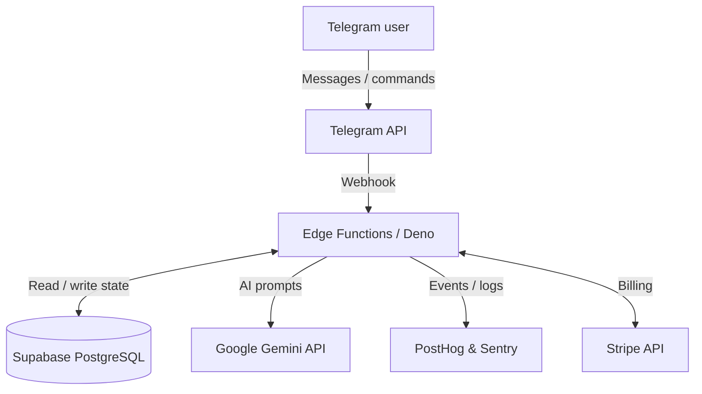

# 🚀 Messenger-Native SaaS Blueprint

**Low friction, high retention.** Build a production-ready, revenue-generating micro-SaaS that lives entirely inside a messenger—without a traditional browser dashboard.

The first application shipped in this model is **[Moon Cue](https://trycue.pl)**.

## 🧠 The philosophy: why “Messenger-Native”?

With traditional SaaS products you constantly fight for the user’s attention. Web apps see heavy drop-off at registration, and native mobile apps ask users to download another heavy binary.

In the **Messenger-Native** model:

- **No install:** The user already has the client app (Telegram).
- **Native notifications:** Messenger message open rates are often 80–90%, compared with roughly 20% for email.
- **Intimacy and attention:** Your product sits next to messages from family and friends, which builds trust and habitual use.

## 🏗 Architecture

The project is built around a **Serverless & Edge-first** architecture:



## ✨ Key features

- **🤖 Onboarding-first flow:** Skip boring signup forms. The user clicks “Get started” on the landing page and lands in Telegram. There they go through an engaging four-step setup conversation (preferences, goals, etc.) and immediately get a 14-day trial—fully automated, zero friction at the start.
- **⚡ Edge Functions (Deno):** Core logic (webhooks, dispatcher) runs at the edge via Supabase Edge Functions—fast response times, elastic scaling, and first-class TypeScript / Deno.
- **🧠 AI composition:** LLM integration via **Gemini API** (Google AI) for advanced analysis and real-time, personalized, empathetic content and tips (“Cues”).
- **💳 Billing (Stripe):** Smooth path from free trial to paid subscription. Stripe handles lifecycle webhooks.
- **📊 Observability:** Production-ready from day one. Deno errors go straight to **Sentry**; funnel and behavior events (e.g. `onboarding_started`, `trial_activated`) are streamed live to **PostHog**.

## 🚀 Quick start

This repository uses the Supabase CLI to bootstrap the Deno Edge Functions architecture.

1. **Link your Supabase project:**

   ```bash
   supabase link --project-ref <your-project-ref>
   ```

2. **Configure secrets (environment variables):**

   ```bash
   supabase secrets set TELEGRAM_BOT_TOKEN="your_token" \
                        GEMINI_API_KEY="your_ai_key" \
                        STRIPE_SECRET_KEY="sk_test_..."
   ```

3. **Build and deploy the webhook (Deno):**

   ```bash
   supabase functions deploy telegram-webhook --no-verify-jwt
   ```

4. **Register the webhook with Telegram:**  
   Send a simple GET/POST request using `setWebhook`, pointing at the public URL of your deployed Supabase function.

## 📈 Observability (Sentry & PostHog)

To keep full visibility into the funnel from day one, we ship solid observability defaults:

- **Sentry:** Initialize the Deno SDK in the Edge Function (`import * as Sentry from "npm:@sentry/deno"`). Silent failures should not break onboarding.
- **PostHog:** Instrument steps in the onboarding-first flow so you can see where users drop off during the conversation (e.g. question #3) before they finish the free trial.

---

*Documentation **v1.3** — schema: `MAJOR.MINOR`; bump **MAJOR** for breaking or structural rewrites, **MINOR** for substantive edits that keep the same doc contract.*
